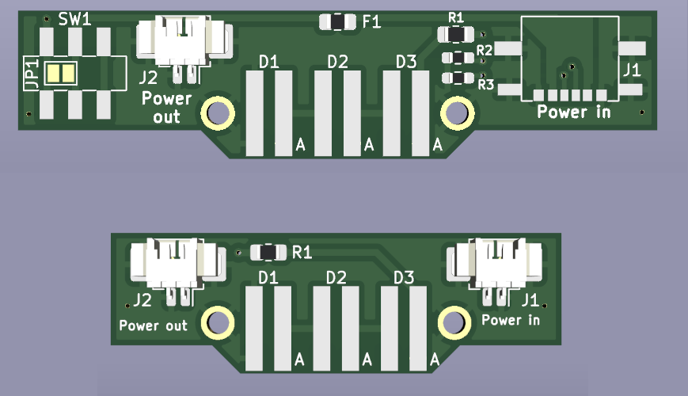

# sensorstrip

License: CC BY-NC 4.0

A replacement sensor bar for use with the Wii with a focus on remaining as slim as possible, with no components on the back of the board to allow mounting directly under a display:

This will of course work on top of a display too, but the bare board will be prone to collecting dust. I have no plans to add a case at this point.

NOTE: This revision is currently untested. It should be electrically sound, but I haven't tested the pre-crimped cords are of sufficient quality.

## BOM

| Reference | Part desc / number | Notes |
|----------|-------------|-------|
| J1 | 6-pin SMD Type C connector - [LCSC](https://lcsc.com/product-detail/USB-Connectors_DEALON-USB-TYPE-C-007_C2927027.html) |  |
| J2 | JST SM02B-GHS-TB - [LCSC](https://lcsc.com/product-detail/Wire-To-Board-Wire-To-Wire-Connector_JST-Sales-America-SM02B-GHS-TB-LF-SN_C189893.html) |  |
| - | JST GHR-02V-S - [AliExpress](https://www.aliexpress.com/item/1005004538759482.html), [LCSC](https://lcsc.com/product-detail/Rectangular-Connectors-Housings_JST-Sales-America-GHR-02V-S_C160416.html) | Use 'Reverse Direction' option |
| D1-6 | IR LED - 940nm - [LCSC](https://lcsc.com/product-detail/Infrared-IR-LEDs_Everlight-Elec-IR204-H60_C60099.html) | 3mm with 2.54mm lead spacing fits well |
| R1 | 120R 0603 - [LCSC](https://lcsc.com/product-detail/Chip-Resistor-Surface-Mount_PANASONIC-ERJ3EKF1200V_C169257.html) | |
| R5,R6 | 5.1K 0603 - [LCSC](https://lcsc.com/product-detail/Chip-Resistor-Surface-Mount_PANASONIC-ERJ3EKF5101V_C123727.html) | Required if powering from C-C cable |
| SW1 | DPDT - [LCSC](https://lcsc.com/product-detail/Slide-Switches_C-K-JS202011SCQN_C221666.html) [(alternative)](https://lcsc.com/product-detail/Slide-Switches_XKB-Connectivity-SS-3235S-L1_C500055.html)  | Optional, but recommended |

## Board

Grab the [gerbers](https://github.com/eatnooM/sensorstrip/blob/main/sensorstrip-gerbers.zip) and upload to your favourite PCB fab [Aisler](https://aisler.net/), [OSHPark](https://oshpark.com/), [JLCPCB](https://jlcpcb.com/). Default settings should be fine - I wouldn't recommend getting the boards any thinner than 1.6mm as may restrict your mounting options (the LEDs can fire straight out at 1.6mm without catching on the display because the board is thicker than the LEDs' radius), [as shown here](resources/sensorstrip-pcb-thickness.jpg)

HASL is a-ok to use and the cheapest option, so would recommend this as the surface finish.

## Assembly

### Tools required
- Soldering iron
- Solder (recommend relatively thin solder - this will make it easier to avoid bridging pins by adding too much)
- Flux (will help keep your joints shiny and happy)
- Tweezers (good luck holding 0603 parts in place with your fingers)

Assembly should be possible with just an iron. As this is a _reasonably_ straightforward process, I'll include instructions for those who may be doing SMD soldering for the first time but would of course recommend trying a practice kit as a cheaper and more instructive learning tool first.

### Steps

You'll be assembling two of these boards - one for each side. Only one of these should have the USB-C port and switch populated - this will provide power to the other via the JST-GH connector.
- Add the resistors first - these will be tricky to access once the taller components are in place. Tin a single pad and introduce the component, then add solder to the other side. If you're using a tip with significant thermal mass, don't hang about for long; you may melt the solder on the other side _through_ the component. An 0603 resistor will happily float away with the surface tension on your iron and make a new home on it.
	- I'd strongly recommend populating R2 and R3 (5.1K) on the board that will be providing power as they'll allow USB C to C cables to be used but if this isn't important to you, feel free to omit them. They will of course serve no purpose on the board receiving power trough J2; don't populate them on that board.
- Solder the USB connector to J1 onto one board. If using an iron, I'd tin one of the outer pads and move the port into place while keeping this molten (without lingering too long, of course!) - Once you're happy with the alignment, add a little solder to the other pads. Be sure plenty to get good strong joints on the shielding - these will be providing the bulk of the mechanical strength keeping the port in place. If you bridge any pads, try adding some flux and introducing a nice clean iron tip.
- Add the JST connector, J2, to both boards. I've not soldered one of these yet - looks like J1 only less leggy.
	- These both use the same keyed connector so the cable you use needs to cross the wires so they wind up on the same side on both boards.
- Add the LEDs. The LEDs are intended to be soldered through-hole, but instead we'll solder them flat against the board so they stick out of the front. The pad labelled with an A is for the anode (positive) leg, typically denoted by a longer leg. You'll have to trim these to size, so make you keep track of the correct orientation (or figure it out with a multimeter in diode mode, or use a non-clipped LED as reference). I'd recommend bending the legs such that the outer LEDs are angled outwards to increase the range of angles the Wiimote can see the bar from.
- Lastly, add the switch to the board with the USB-C port. Handily, orientation does not matter!
	- Alternatively, you can bridge the jumper J1 with a blob of solder to force the board to be always on when powered. You don't need to do this for the board receiving power through J2 - this is affected by the main board's power switch too.

## Going off-piste

The latest revision's split design was suggested by somebody smarter than me as a way to support a wider range of distances between display and player. Naturally, I completely disregarded this advice. Later, however, I found out that the GunCon 3 also uses IR LEDs in a similar fashion to the Wiimote, but its LEDs are:
- Placed in the upper corners of the display
- Arranged in a triangular pattern, presumably to increase viewable angles
- 850nm wavelength

This inspired me to split the bar up after all, addressing exactly one of the above issues. I just learned somebody else is working on some boards tailored to the GunCon 3 literally as I'm writing this, but nonetheless I'd love to hear if someone had any luck using this board with some 850nm LEDs and a GunCon 3 (possibly tweaking the value of R1 lower - some brief research suggests 850nm emitters have higher forward voltage).

I'd also be curious to see how a Wiimote handles a sensor bar populated with 850nm emitters. https://wiibrew.org/wiki/Wiimote suggests 850nm will work with a Wiimote, but the LEDs will need to be a little brighter than with the 940nm ones they're intended for. Maybe there's a chance to try and get simultaneous support for Wiimote and GunCon 3 out of a single setup. Or maybe two of these is a more workable solution - after all, constantly adjusting spacing would be annoying and a lot of PCB fabs have a minimum quantity of 5 anyway.
